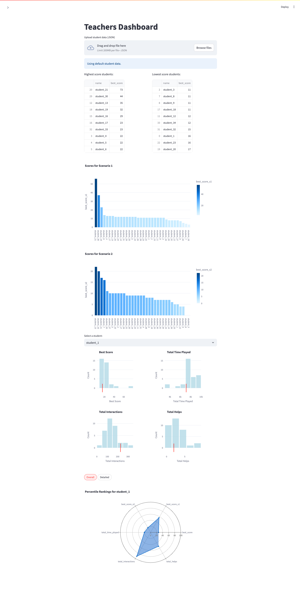
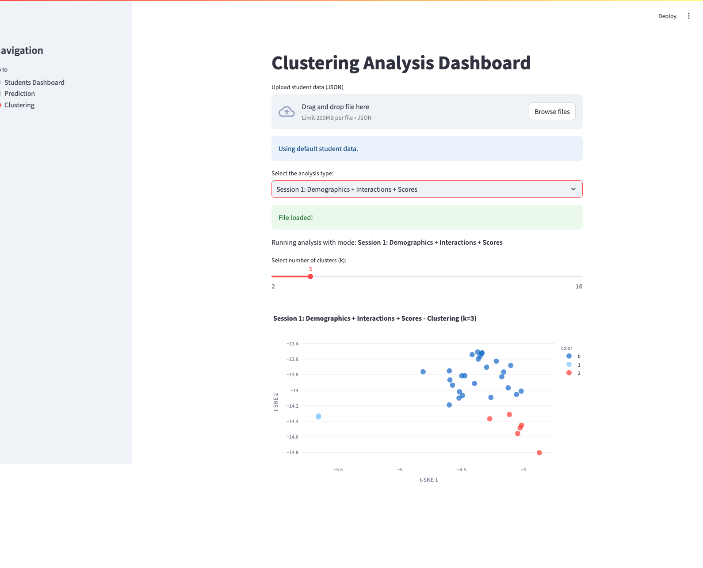
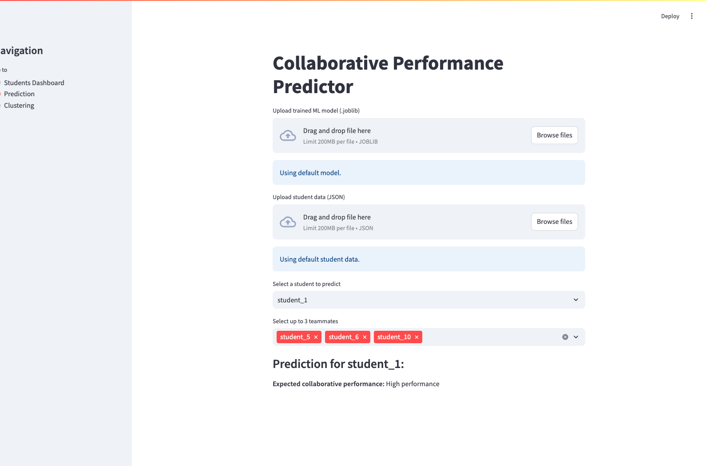

# JOINclusion Performance Analysis Platform

This repository offers a powerful toolkit for analyzing and predicting student collaborative performance based on interaction data collected from educational games or learning environments. It combines machine learning, clustering algorithms, and an interactive dashboard built with Streamlit.

---

## Features

- **👩‍🏫 Teacher Dashboard**: Provides intuitive tools for teachers to explore and interpret student activity data.
- **📊 Clustering Analysis**: Automatically detect behavioral patterns in student data using clustering techniques.
- **📈 Predictive Modeling**: Use machine learning to estimate a student's collaborative performance potential.

---

## Project Structure

- `clustering.py`: Functions for processing data and clustering analysis.
- `dashboard.py`: Streamlit UI logic to present different dashboard modes.
- `data_analysis_teachers.py`: Data preparation functions tailored for teacher insights.
- `performance_prediction.py`: ML model utilities to predict student collaboration effectiveness.

---

## Dashboard Previews

### 👩‍🏫 Teacher Dashboard
_A visual summary of student progress and behavioral metrics._


### 📊 Clustering View
_Cluster student profiles based on actions and performance._


### 🤖 Performance Prediction
_Predict team performance based on selected students' features._


---

## Installation

### Prerequisites

Ensure Python 3.8+ is installed. Then install required packages:

```bash
pip install -r requirements.txt
```

---

## Running the Application

```bash
streamlit run dashboard.py
```

---

## Usage Instructions

### Predicting Performance

1. Prepare a student JSON file (e.g., from exported gameplay sessions).
2. Upload a trained ML model (e.g., `model.pkl`) via the dashboard.
3. Navigate to the **Prediction** tab to see predicted collaboration scores.

### Clustering

1. Load a dataset of multiple students.
2. Adjust clustering parameters and view resulting groups.
3. Analyze behavioral patterns for different groups.

### Teacher Dashboard

- Use this mode to explore individual and group behavior with filters and summaries.

---

## Technologies Used

- Streamlit
- Scikit-learn
- Pandas, NumPy
- Matplotlib, Seaborn

---

## License

MIT License

---

## Authors

- Enrique Hortal / Yusuf Can Semerci / Annanda de Freitas Sousa - Department of Advanced Computing Sciences, Maastricht University
